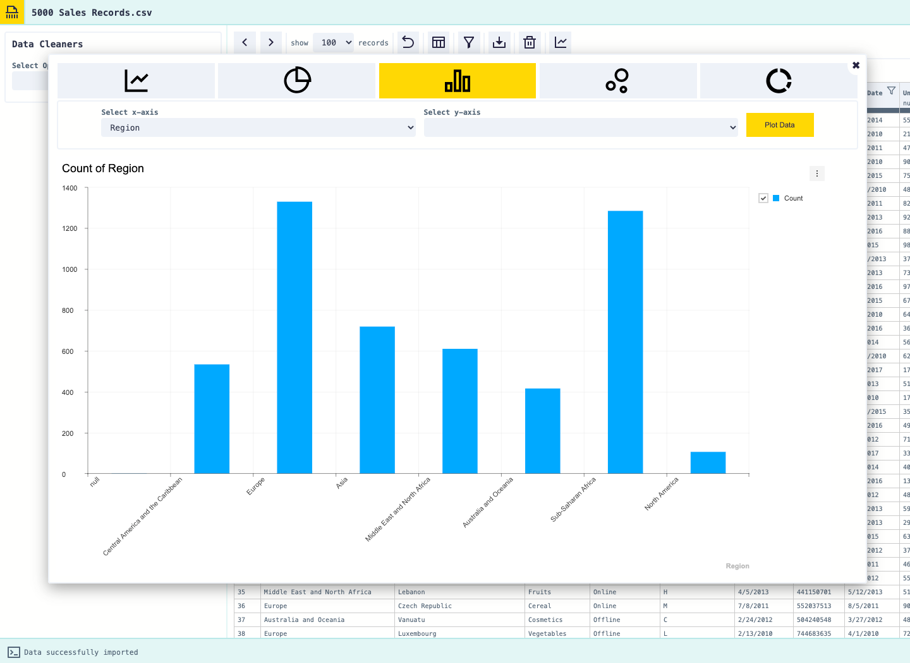

[](https://forthebadge.com)
[](https://forthebadge.com)
[](https://forthebadge.com)
[](https://forthebadge.com)
[](https://forthebadge.com)

# Data Cleaner

|   |  |  |
|:---:|:---:|:---:|
|  |  |  |


A simple application to make it easier to clean csv files.

The friendly interface lets you easily apply common functions. 

The application works locally, no data leaves your machine and results can be exported out.

# Project Aim

Inital proof of concept application to provide an easy to use interface for applying common data cleaning functions for csv files quickly as well as some providing some features to gain some insight from the data. 

This application was built to expand on the knowledge of the framework vue.js including state managment with vuex.


# Built With
- Vue.js (v2)
- Vuex
- JavaScript
- HTML
- CSS


# Demo
Live demo can be found [here](https://data-cleaner.netlify.app/)

Test dataset can be downloaded from the application homepage or from <a href="http://eforexcel.com/wp/wp-content/uploads/2017/07/5000-Sales-Records.zip">here</a>

# Install and Running
## Project setup
```
npm install
```

### Compiles and hot-reloads for development
```
npm run serve
```

### Compiles and minifies for production
```
npm run build
```

### Lints and fixes files
```
npm run lint
```

### Run Tests
```
npm run test
```

# Usage

Simply select your data (**making sure you select a CSV file with headers**), explore your data and apply the needed cleaning functions. Once done just export your cleaned data.


# Roadmap
- Improved form validation when applying cleaning rules
- Optimisations to handle larger data sets
- Support for additonal file types such as tsv
- Ability to save datasets in local storage to make them available later from within the app
- Exapand undo previous action feature (rather than just being able to undo the last action only)
- Additonal charting options
- Additional cleaner functions (number formatting, remove duplicates, remove empty rows, emails, web urls, calculations)
- Ability to sort data
  

# Credits

Icons from [Remix Icon](https://remixicon.com/)

CSV file parsing from Papaparse [Papa Parse](https://www.papaparse.com/)

JS extras with [Lodash](https://lodash.com/)

DateTime handling with [Luxon](https://moment.github.io/luxon/)

Charting from [Toast UI](https://ui.toast.com/tui-chart)

Tooltips with [Tippy.js](https://atomiks.github.io/tippyjs/)

Testing with [Jest](https://jestjs.io/)

# License
Usage is provided under the [MIT License](http://opensource.org/licenses/mit-license.php). See LICENSE for the full details.
